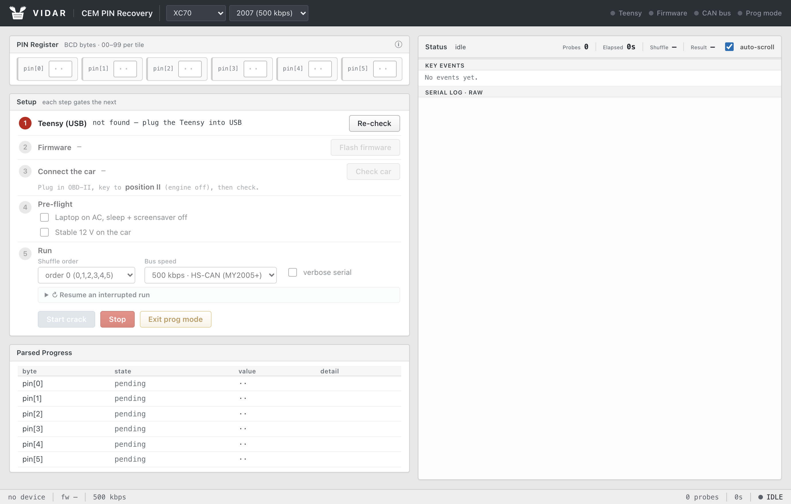
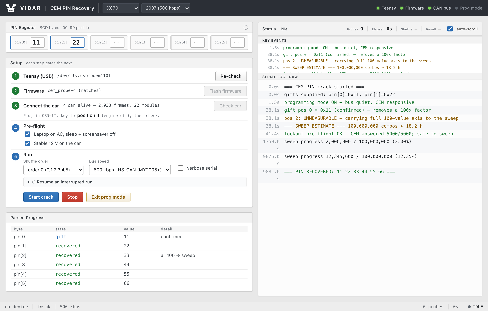
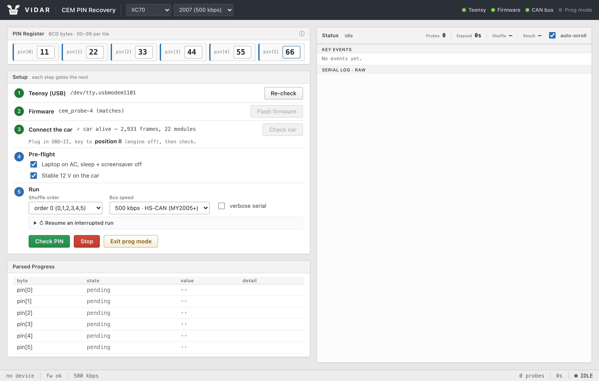
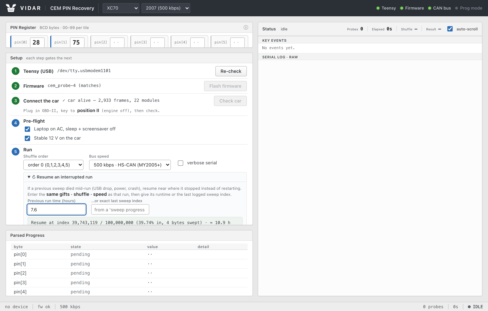

# Tutorial — recovering a CEM PIN, start to finish

A hands-on walkthrough: from a bare Teensy to a recovered (and verified) PIN. For the theory behind
each step, see [HOW-IT-WORKS.md](HOW-IT-WORKS.md). **Your car, your call** — no warranty, and if you
brick something that's on you (Xemodex will gladly fix it for a fee).

## The idea in one paragraph

A Volvo P2 CEM won't grant authenticated access without a 6-byte PIN, and that PIN can't be read or
calculated. But the CEM leaks: it checks the PIN bytes in a fixed order and answers a *correct* leading
byte a hair slower. Measure that timing on a microcontroller (a PC's USB jitter is far too coarse), and
the `100⁶` space collapses to a handful of `100`-way searches plus a final brute sweep of whatever the
timing can't resolve. This tool does the measuring and the searching, and drives it all from a browser.



## 0. What you need

- A **Teensy 4.0** + **2× CAN transceivers**, wired to the standard `vtl/volvo-cem-cracker` pinout
  (CAN1 TX=22 / RX=23). A **data** USB cable (not charge-only).
- The car, with a way to keep a **stable 12 V** on it (charger/maintainer) for the whole run.
- A laptop (macOS, Linux, or Windows with Git Bash). Keep it on AC with sleep disabled.

## 1. Install everything

```sh
bash setup.sh
```

This installs Python + a local virtualenv + `pyserial` + PlatformIO, sets up the Teensy USB driver for
your OS, builds the firmware, offers to flash it, and can launch the UI. Re-runnable any time.

## 2. Flash the firmware (Teensy on USB, NOT on the car yet)

`setup.sh` offers this, or do it manually:

```sh
cd firmware && pio run -t upload
```

The UI also flashes automatically if it sees the wrong firmware version. Confirm the boot banner reads
`# cem_probe ready (Volvo P2) cem_probe-N …` (a serial monitor at 2,000,000 baud).

## 3. Wire to the car

- Tap **HS-CAN at the OBD-II port**: pin **6 = CAN-H**, pin **14 = CAN-L**, ground on pin **5**.
- Tie the transceiver's **RS pin to GND** (high-speed mode) or the bus looks dead.
- **Leave the 120 Ω terminators OFF** in-car — the vehicle bus is already terminated.
- Ignition to **position II** (run, engine off) so the CEM is awake.
- Confirm **stable 12 V** — voltage sag corrupts the sub-µs timing.

## 4. Launch the UI and walk the wizard

```sh
.venv/bin/python -m cemcrack.webui      # open http://127.0.0.1:8731
```

The gated wizard unlocks each step only when the previous one passes:

1. **Teensy (USB)** — auto-detects the board's serial port.
2. **Firmware** — checks the version; offers a flash if it doesn't match.
3. **Connect car** — instructs OBD-II + key in II, then passively sniffs: hundreds of frames/sec means
   you're connected and the CEM is awake. **0 frames** ⇒ fix the wiring/key before going further.
4. **Pre-flight** — tick the boxes: laptop on AC, sleep off, stable 12 V.
5. **Run** — pick the shuffle order and bus speed, enter any known bytes, Start.

## 5. Run a crack

- **Gifts:** type any PIN bytes you already know into the 6 tiles (two BCD digits, `00`–`99`). Each one
  removes a 100× factor from the final sweep — this is the single biggest lever on run time.
- **Shuffle order:** the per-model byte permutation. The wrong one yields no signal (the gift re-confirm
  catches that in about a minute). If you don't know it, the four orders are listed; the right one is
  model-specific.
- **Bus speed:** **500 kbps** for MY2005+, **250 kbps** for MY≤2004 (the header car-picker sets this for
  you), 125 kbps for the slow body bus.
- Hit **Start** (it confirms first). The car enters programming mode for the duration.

Watch the live log on the right. The engine measures each byte and tags it **measured** (timing
resolved it) or **unmeasurable** (carried in full to the sweep), then prints a **SWEEP ESTIMATE** —
*how many combinations and how long* — **before** the brute sweep begins.

**The estimate is your decision point.** Each byte left to the sweep multiplies the time by 100:

| bytes known/measured | combos to sweep | ~time |
|---|---|---|
| 4 of 6 | 100² = 10,000 | seconds |
| 3 of 6 | 100³ = 1,000,000 | ~10–15 min |
| 2 of 6 | 100⁴ = 100,000,000 | ~18–22 h |

If the estimate is too long, **Stop** and get another known byte. Otherwise let it run — a hit is a real
CEM unlock (`50 B9 00`), and the recovered PIN stays shown in the tiles on **DONE**.



## 6. Verify a PIN (Check PIN)



Once you have a candidate PIN, type **all six** bytes into the tiles. The button turns **green** and
becomes **Check PIN**: it fires one unlock attempt **plus a deliberately-wrong negative control** and
tells you whether that exact PIN unlocks this CEM — no crack, just a ~5-second verify. A confirmed result
is a positive unlock *and* a rejected wrong-PIN control.

## 7. If a long run gets interrupted



Power blip, USB drop, laptop sleep? Open **"Resume an interrupted run"**, enter the same gifts + shuffle
+ speed as the dead run, and give either its **runtime** (the tool estimates how far it got, rewound a
safety margin) or the **last sweep index** from its log. Start, and it resumes near where it died instead
of from zero.

## 8. Always exit programming mode

The crack auto-sends the reset on finish/stop. To do it by hand, click **Exit prog mode** — it broadcasts
`FF C8` and returns every module to normal. A **key cycle will NOT clear** programming mode on a P2 (the
modules sit on constant 12 V). If something goes wrong and the bus stays silent, the firmware also
auto-exits after ~10 s of host silence; the guaranteed last resort is a **battery negative-terminal
disconnect (~90 s)**.

## Troubleshooting

- **Every probe times out (`-1`) on a live bus** → the CEM only answers in programming mode; the firmware
  enters it automatically, so all-timeouts means the wiring/ids are wrong, not the PIN.
- **0 frames on "Check car"** → OBD not seated, key not in II, RS-pin in standby, or CAN-H/L swapped.
- **Gift re-confirm rejects a byte you trust** → suspect a wrong shuffle order or voltage sag, not a wrong
  gift; re-seat power/ground and retry.
- **Serial monitor diagnostics** (2,000,000 baud): `SNIFF <ms>` (listen), `TXSTAT` (TX health),
  `URAW <16hex> <ms>` (dump reply frames), `VERSION`.
